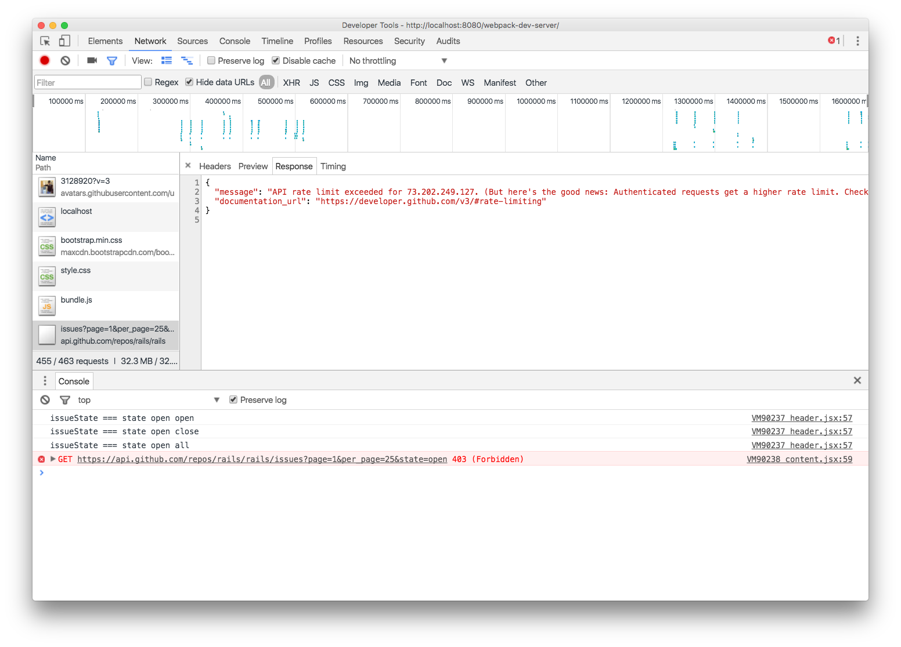

# README

Author: Alan(Lin Dong)

Date: 6/10/2016

Github: [Link](https://github.com/ldong/github_issues_viewer)

Demo: [Link](http://ldong.org/github_issues_viewer/)

## Tech Stack

1. Implemented using React
2. Used Bootstrap for CSS Styling and responsiveness. (Twitter Rocks)

## Thoughts
By going over the [github developer APIs](https://developer.github.com/v3/issues/#list-issues-for-a-repository)

I see that issues has 3 states: `open`, `closed`, or `all`.

And the assignment asks to display only issues with `open` state, but I thought it would be nice to display in `all` state in backward chronological order.

I also found the API supports pagination by passing `page` and `per_page` parameters. i.e. `https://api.github.com/user/repos?page=2&per_page=100`

## Functionalities

### Mentions
Implement `mention` functionality with `@`:

Use regular express to massage data by converting string from @username
to link <a target="_blank" href="https://github.com/username">@username</a>

### 140 Characters Summary

1. Truncate to 140 characters as required.
2. use CSS to text-overflow: ellipsis to style, see style.css for details.

Tried to 2) use CSS only, but it seems too much work, see commented out code for `.para-140-characters` in [style.css](./code/style.css). Instead I implemented 1) in [code](./code/views/listView.jsx)

### Pagination

Without exhausting the browser client, implementing `Pagination` is essential.

Limitation: no exact number of total issues, since Github API issues API does not officially support it.
Embarrassingly like this:

Workaround:

1. Show only left and right
2. Visit issues page first, scrape out the last page number.

I chose 1) since it makes sense and ethical.

# Retrospect Notes

No React-router nor flux libraries were used. Just used plain ES6. Maybe I should use React-router for
keeping track of which pageIndex, issue state, and repo's issues were browsed. But I think for simple app, this is sufficient.

# Reference

Used APIs:

1. https://api.github.com/repos/rails/rails/issues?page=1&per_page=1
2. https://api.github.com/repos/rails/rails/issues?page=1&per_page=1&state=closed
3. https://facebook.github.io/react/docs/component-specs.html

